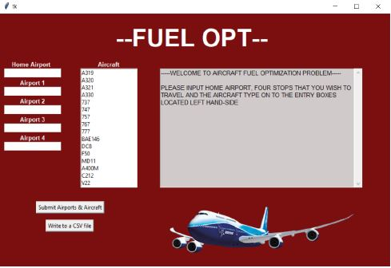
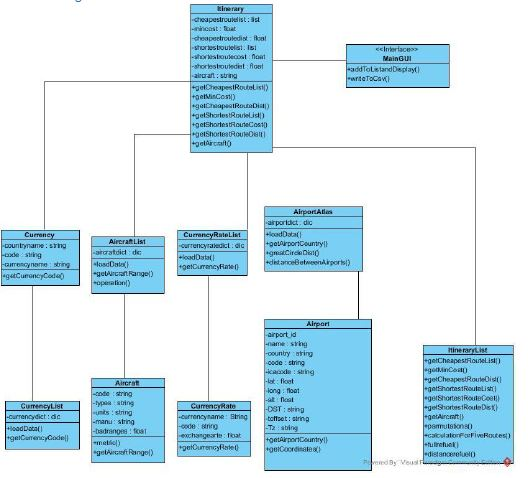

# Airplane-route-optimization

## 1. A brief summary
This program is designed to find shortest and cheapest routes of an airplane that is doing five trips each week. It takes parameters from a GUI which are one home airport and four other airports that the plane will stop during its route and finally an aircraft type from a given list. After that it calculates shortest route and cheapest route and display the results.
This program needs additional documents to execute which are;
- Airport.csv: Contains information about all the airports around the world.
- Aircraft.csv: Contains information about some aircrafts
- Countrycurrency.csv: Contains information about currencies about countries
- Currencyrates.csv: Contains information about the rates between euro and other currencies

## 2. Information about Interface
There is a screenshot of the initial interface the program has when it is opened shown below. Below Home Airport text user can input the IATA code of the home airport which the aircraft depart from and return for the end of the route. Below that there are four airport input widgets that user can type the IATA codes of the airports that aircraft will fly to. Near that widgets there is a list box which user can click on the aircraft that will conduct that specified route. After typing airports IATA codes and deciding the aircraft type user can click submit for displaying the results which are shortest and cheapest routes calculated by calculations which will described in sections below. Also after displaying the results user can write these results to a csv file which is called bestroute.csv.

## 3. Program Overview
### 3.1. Class Explanations
#### 1. Airport: Stores information about the airports that airport.csv file.
##### Attributes  
- Airport_id: ID of the airport  
- Name: Name of the airport  
- City: Cities that an airport located in  
- Code: 3 letter IATA code of the airport  
- Ica code: 4 letter ICA code of the airport  
- Lat: Latitude of the location that airport is located  
- Long: Longitude that the airport is located in  
- Alt: Altitude of the airport  
- Toffset: Timezone offset  
- DST: Daylight saving time  
- Tz: timezone  
##### Methods
- getCoordinates():A method that returns the latitude and longitude of given airport  
- getCountry(): Returns the country of the given airport  
#### 2. AirportAtlas: Opens airport.csv file and sends the information contained in that file to airport class also have some other methods
##### Attributes  
- Airportdict: A dictionary that holds the information about airports with IATA key.
##### Methods
- loadData():A method that opens airport.csv file, assigns them to a dictionary and sends them to airport class.
- getAirportCountry ():A method that takes the IATA code and send the address of it to airport class for bringing the airport country.
- greatCircleDist(): Takes the latitude and longitude of two airports and return the great circle distance between them
- distanceBetweenAirports(): Takes two IATA codes as input sends them to get coordinates(lat and long) after that sends those to greatCircleDist to get the distance, then sends it back where it is requested
#### 3. Aircraft: Stores information about the aircrafts.
##### Attributes
- Code: Name of the aircraft
- Types: Type of the aircraft
- Units: Represent the range of the aircraft (if it is metric than range is shown by km, if it is imperial than the range s shown by miles.
- Manu: Manufacturer of aircraft.
- Ranges: Range of the aircraft.
###### Methods
- metric():A method that checks whether unit of the aircraft is imperial, if it is changes it to km.
- getAircraftRanges(): Returns the range of an aircraft.
#### 4. AircraftList: Opens aircraft.csv, sends that information to aircraft class also have some other methods.
##### Attributes
- AircraftDict: A dictionary that holds information about aircrafts and the key is its name.
##### Methods
- loadData():A method that opens aircraft.csv file, assigns them to a dictionary and sends them to aircraft class.
- getAircraftRanges(): Takes the name of aircraft and with the help of the dictionary sends the address of it to airport class which returns the range of an aircraft and send that value to where it requested.
5. Currency: Stores information from currency.csv.
##### Attributes
- Countryname: Holds the currency’s country name
- Code: Currency code
- Currencyname: Holds currencyname
##### Methods
- Currencycode():A method that returns currency’s code.
#### 6. CurrencyList: Opens currency.csv and assigns the information to a dictionary and sends them to currency class.
##### Attributes
- Currencydict: Holds the information about the currency with a key of countryname.
##### Methods
- getCurrencycode(): A method that takes the dictionary key and sends the address to currency for returning requested data.
##### 7. CurrencyRate: Stores information from currencyrate.csv.
###### Attributes
- Currencyname: Holds the currency’s country name 
- Code: Currencyrate code
- Exchangerate: Holds exchange rate with euro
##### Methods
- getCurrencyRate():A method that returns currency’s exchangerate.
#### 8. CurrencyRateList: Opens currencyrates.csv and assigns the information to a dictionary and sends them to currencyrate class.
##### Attributes
- Currencyratedict: Holds the information about the currencyrate with a key currencycode.
##### Methods
- getCurrencyRate(): A method that takes the dictionary key and sends the address to currencyrate for returning requested data.
#### 9. Itinerary: Stores information about the itineries and sends back information when needed.
##### Attributes
- Cheapestroutelist: Stores cheapest route list.
- Mincost: Stores the minimum cost that is found via calculation.
- Cheapestroutedist: Stores cheapest route distance.
- Shortestroutelist: Stores shortest route list.
- Shortestroutecost: Stores shortest route cost found via calculation.
- Shortestroutedist: Stores shortest route distance.
- Aircraft: Stores aircraft name.
##### Methods
- getCheapestRouteList (): Returns cheapest route list.
- getMinCost(): Returns minimum cost.
- getCheapestRouteDist(): Returns cheapest route distance.
- getShortestRouteList(): Returns shortest route list.
- getShortestRouteCost(): Returns shortest route cost.
- getShortestRouteDist(): Returns shortest route distance.
- getAircraft(): Returns selected aircraft name.
#### 10. ItineraryList: Most important class in the program. Has a method call in __init__ that calls loadData to populate itinerary class with attributes but before that does the calculation for finding cheapest and shortest route.
##### Methods
- getCheapestRouteList (): Returns cheapest route list.
- getMinCost(): Returns minimum cost.
- getCheapestRouteDist(): Returns cheapest route distance.
- getShortestRouteList(): Returns shortest route list.
- getShortestRouteCost(): Returns shortest route cost.
- getShortestRouteDist(): Returns shortest route distance.
- getAircraft(): Returns selected aircraft name.
- permutations(): Finds all the permutations between departing from home and returning it.
- calculationForFiveRoutes(): Has two method calls inside for calculations so it takes its solutions which are shortest and cheapest route by refueling whole tank and the other is calculating cheapest route(which also gives shortest) refueling enough for completing specified leg.(second one is a little optimization)
- Fullrefuel(): Finds cheapest and shortest route by refueling whole tank
- Distancerefuel(): Finds cheapest route by refueling just enough for completing the leg.
#### 11. Main_code: It is dedicated for GUI has a a lot of attributes for constructing the interface and some methods.
##### Methods
- addToListandDisplay ():For adding the user inputs to a list and displaying the result.
- writeToCsv (): Writes result to csv file.

### 3.2. Class Diagram

